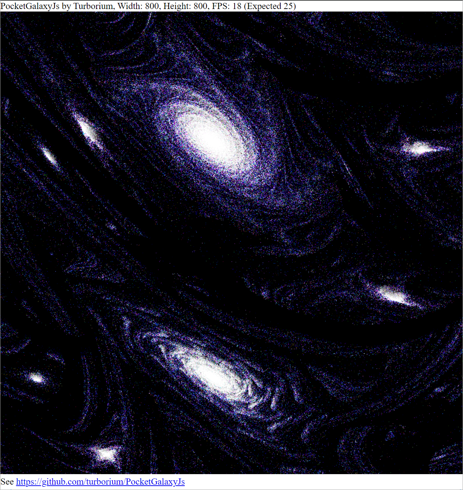

# PocketGalaxyJs
**PocketGalaxy animated pixel effect**

---

Try online: https://turborium.github.io/demos/PocketGalaxyJs


Maked by JavaScript with love.  
Also, see ObjectPascal version: https://github.com/turborium/PocketGalaxy

---
Inspired by article [Complex beauty in a simple formula](https://habr.com/ru/articles/817869/) and comment by [kipar](https://habr.com/ru/articles/817869/#comment_26881773) with code:
```pascal
RandSeed := 1;
for i := 1 to 100 do
begin
  x := random;
  y := random;
  color := Random(MaxLongint);
  for j := 1 to 1000 do
  begin
    pr2d_Pixel(x*1000,y*1000,color);
    x := Frac(x+cos(y));
    y := Frac(y+sin(x));
  end;
end;
```
